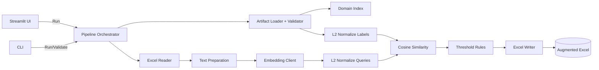

# Architecture Specification (This Project)

Purpose
Define the architectural structure for a deterministic Q&A domain classifier that consumes a QA_RAG_Classifier artifact bundle as a read-only contract.

System Overview
This Project is a linear, stateless batch pipeline with strict separation between orchestration (CLI/UI) and classification logic. All compatibility rules derive from artifact_manifest.json and label_index.json.

Components
- UI (Streamlit): rendering and parameter input only.
- CLI (Rich): run/validate commands only.
- Pipeline Orchestrator: end-to-end flow coordination.
- Artifact Loader + Validator: bundle ingestion and contract enforcement.
- Embedding Client: Azure OpenAI embeddings for Q or Q+A text.
- Normalization: L2 normalization for queries and labels.
- Classifier: cosine similarity and threshold rules.
- Excel Reader/Writer: I/O while preserving row order and columns.
- Error Types: typed fatal and row-level errors.

Data Flow (Mermaid)

Interfaces
- UI/CLI invoke pipeline entrypoints only.
- Pipeline calls Artifact Loader/Validator and Embedding Client.
- Pipeline reads and writes Excel via io modules.
- Classifier accepts only normalized vectors and threshold config.

Execution Model
- Synchronous, single-pass batch execution.
- No background jobs, no incremental state.
- Deterministic ordering using label_index.json.

Determinism Guarantees
- No randomness or sampling.
- Fixed domain ordering and stable label vectors from artifact bundle.
- L2 normalization applied deterministically.
- Same input + same artifact + same config ⇒ same output.

Error Handling Boundaries
- Fatal errors stop the pipeline:
  - Missing artifact files.
  - Model mismatch.
  - Vector dimension mismatch.
  - Missing question column.
- Row-level errors are isolated:
  - invalid_input classification with preserved row order.
  - Missing answer in Q_PLUS_A falls back with warning flag.

Non-Goals
- No domain discovery or merging.
- No artifact mutation.
- No database usage.
